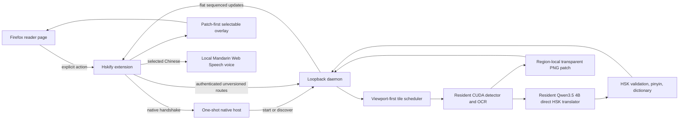

# Hskify performance architecture

Hskify is a local Firefox-to-native pipeline specialized for low time-to-first
translated dialogue on one CUDA machine class. The browser and daemon exchange
an append-only sequence of small region updates; they never wait for or
transfer a reconstructed page.

## System shape

## Build affinity and trust boundary

`hskify-windows-x86_64-msvc-cuda13.1-sm89-2026-07-26-r2` is compiled into the TypeScript and Rust
contracts. Native handshake requests and responses, health responses, and job
creation metadata must carry that exact value. A different value is rejected.
There is no protocol-version header, range negotiation, compatibility shim, or
migration adapter.

The Windows release wrapper writes a post-success, ignored JSON attestation
covering the complete tracked and untracked-nonignored source identity, exact
x86_64 MSVC release/CUDA configuration, pinned toolchain and llama.cpp tag,
device-0 hardware/driver claims, and SHA-256/byte identities for both native
binaries. Packaging and benchmark preflight reject missing, stale, mutated, or
nonmatching attestations.

The native host accepts only the registered
`local.hskify.hsk_manga` manifest whose executable resolves to the running
binary and whose sole allowed extension is
`hsk-manga-translator@local.hskify`. It asks the daemon for a fresh 256-bit
bearer token bound to the exact canonical `moz-extension://` origin.

The daemon binds to a random `127.0.0.1` port. Browser requests require the
exact `Host`, the active extension origin (standard `Origin` and/or
`X-HSK-Manga-Extension-Origin`), and the bearer token before request-body
polling. CORS allows only that origin and the required GET, POST, PUT, and
DELETE methods. No general application router, URL fetch, telemetry, provider
credential, or remote translation path is mounted.

## Direct progressive data flow

1. The extension uploads one raster plus strict metadata to `POST /jobs`.
   Byte, MIME, hash, declared dimension, decoded dimension, pixel, and decoder
   allocation checks occur before the job begins.
2. The source is decoded once. The adapter divides it into 2,048-pixel tiles
   with 410-pixel overlap and reprioritizes remaining tiles whenever the
   viewport changes. Detector input is letterboxed to at most 1,280 pixels.
3. The official PP-OCRv5 mobile text detector processes true CUDA batches of
   up to six tiles. Line candidates are spatially deduplicated.
4. PP-OCRv5 English recognition runs in batches of eight. Adjacent lines with
   compatible geometry and inferred color are grouped into story regions;
   differently colored emphasis and separated balloons stay independent. A
   region is accepted only after grouping, when it meets the 0.45 confidence
   and English/story-text gates. On a tile with explicit credit/release
   context, isolated uppercase name labels are excluded; the same form on a
   normal story tile remains eligible.
   Sound effects, credits, scanlation promotion, branding, non-English text,
   and ambiguous OCR do not enter translation or cleanup.
5. A small transparent PNG is constructed for the accepted text geometry.
   Foreground and background colors are inferred from local pixels rather than
   a fixed palette. Only the erase/glyph mask has alpha; pixels outside it
   remain transparent, and cleanup preserves local color, gradients, texture,
   contours, and styling instead of whitening the region.
6. Visible accepted regions jump ahead of off-screen work. Translation batches
   contain up to six regions and normally flush once three are pending; a
   visible arrival flushes immediately.
7. Qwen3.5 4B translates English directly to HSK 2.0-targeted Simplified
   Chinese in one primary generation. The same line can return a reserved
   non-story marker, but the daemon honors it only when deterministic source
   evidence supports credits, release metadata, SFX, non-English OCR, or
   fragmented gibberish. Unsupported exclusions enter the single targeted
   repair instead of disappearing. `hsk-control` validates vocabulary; the
   direct protocol validator checks protected names, standalone numbers,
   question intent, and output structure. Digits embedded in Latin OCR tokens
   such as `IDENTIT4` are not treated as semantic numbers. Only rejected items
   may enter one targeted repair batch.
   This is not a page-wide faithful pass followed by an HSK rewrite.
8. For each completed region, the daemon stores the patch blob first and then
   appends `regionReady`, which carries the patch descriptor, geometry, source
   text, base/direct Chinese, displayed Chinese, pinyin, style, layout, and HSK
   status.
9. Firefox fetches and validates the PNG, decodes it, inserts it in the patch
   layer, and only then inserts the selectable text. Later updates continue
   independently.

Completion is a terminal event in the same log. It does not unlock a separate
result representation.

## Scheduling and cache identity

The daemon stays warm for a 30-minute idle window and uses four Tokio workers,
at most eight general blocking threads, one serialized priority CUDA
scheduler, and one dedicated six-thread Rayon pool for browser image
preprocessing. The detector, OCR model, local LLM
application state, and HSK control data are lazy `OnceCell` residents, so later
jobs reuse loaded state.

The in-memory translation cache is keyed by:

- normalized OCR text;
- up to six preceding dialogue utterances;
- the complete proper-name glossary;
- requested HSK level;
- model ID and exact model revision;
- prompt hash;
- validator hash; and
- the full HSK/dictionary control revision.

Changing any output-affecting dependency invalidates the cache. There is no
project cache, page history, stored page reconstruction, or level-change
retranslation endpoint.

Decoded images use a 512 MiB byte-bounded LRU. Completed per-image region
results and PNG patches also have a byte-bounded
2 GiB persistent cache. Its key includes the complete strict job request,
source hash, exact build fingerprint, and a fingerprint of every
output-affecting model, prompt, validator, dictionary, and pipeline resource.
Entries are atomically installed only after visible processing completes.
No detector, OCR, translation, or patch intermediate is written to disk.

The job log is append-only, starts at sequence 1, rejects regressive overall
progress, rejects duplicate region publication, and permits one terminal
`complete`, `failed`, or `cancelled` event. Clients long-poll after the last
acknowledged sequence, so extension background suspension does not require a
second status/result model.

## Resource envelope

| Resource | Default |
| --- | ---: |
| Image multipart field | 20 MiB |
| JSON metadata field | 64 KiB |
| Complete HTTP body | 21 MiB |
| Decoded pixels | 25,000,000 |
| Either dimension | 16,384 px |
| Decoder allocation | 128 MiB |
| One patch blob | 16 MiB |
| Retained jobs | 128 |
| Retained sources and patches | 256 MiB |
| Authenticated in-flight requests | 64 |
| Updates per job | 10,000 |
| One update long-poll | 20 seconds maximum |
| Idle daemon window | 30 minutes |

Terminal inactive jobs are evicted oldest-first when job or byte capacity is
needed. Active jobs are never eviction candidates. Patch blobs are owned by
one job and removed with it.

## Hardware boundary

The performance build is CUDA-only and gated to an NVIDIA GeForce RTX 4080
SUPER with at least 16,000 MiB, compute capability 8.9, and the pinned CUDA
13.1 compiler packages. This is an intentional optimization boundary, not a
recommended tier among several. Results from another GPU, a CPU path, or a
different model revision are not evidence for this build.

## Reader features retained

The progressive architecture preserves:

- selectable Chinese with displayed pinyin;
- local longest-match dictionary definitions and HSK overlay;
- region context showing direct/displayed Chinese and source English;
- original/Chinese/hold-to-compare controls; and
- local-only Mandarin pronunciation using an eligible Firefox/OS voice.

See [the browser contract](browser-contract.md) for exact routes and event
shapes and [the Chapter 5 evidence plan](chapter-5-benchmark.md) for the
complete 36-image gold corpus and the packaged measurements still to be run.
