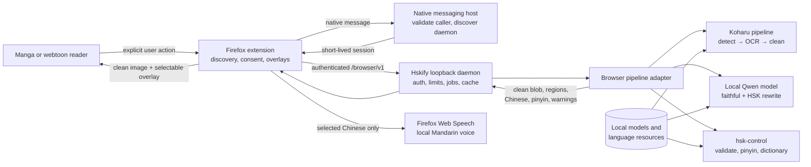

# Hskify architecture

Hskify is a local Firefox companion built around a narrow browser-facing
service and a reused Koharu image pipeline. The browser layer owns discovery,
consent, and presentation. The native layer owns trust boundaries, bounded job
execution, and adaptation. Koharu remains the production image-processing
engine rather than being copied into a second browser-specific stack.

## System overview

## Ownership boundaries

| Component | Owns | Must not own |
| --- | --- | --- |
| Firefox extension | User-triggered page discovery, exact-origin permission requests, image acquisition, progress UI, overlays, selection, lookup display, and pronunciation controls | Model loading, native secrets, arbitrary page access at install time, or remote translation |
| Native messaging host | Validation of the registered manifest and add-on identity, bounded framing, daemon discovery/start, and one-time session handoff | Long-running jobs, HTTP serving, ML initialization, or browser content |
| Browser daemon | Per-user locking, random loopback binding, authentication, request limits, immutable job snapshots, cancellation, cache retention, and `/browser/v1` | Koharu's general RPC/UI routes, permissive CORS, telemetry, URL fetching, or cloud credentials |
| Browser pipeline adapter | Verified image import, Koharu pipeline invocation, browser-specific artifacts, stable protocol geometry, HSK rewrite loop, and warnings | A duplicate detector, OCR stack, blob store, job runtime, or local-LLM implementation |
| Koharu layers | Project/session types, blob store, engine registry, ML runtime, detection, OCR, cleaning engines, shared cancellation, and model state | Firefox permissions, browser authentication, HSK policy, or extension rendering |
| `hsk-control` | Reproducible HSK data import, vocabulary validation, proper-name exceptions, longest-match pinyin, and CC-CEDICT-compatible lookup | Translation generation, OCR, page geometry, or user-interface state |
| Installers/data manifests | Exact native-host registration, packaging, artifact checksums, fonts, and licence metadata | Silent model selection or unreviewed redistribution |

The browser protocol is the seam between the extension and daemon. Koharu
types do not cross that seam directly; the adapter converts them to versioned,
validated browser contracts.

## Data flow

1. A popup action causes the extension to inspect the active reader and request
   only the exact page or image-CDN origins it needs.
2. The extension sends a bounded native message. The host validates the
   manifest path and permanent add-on identity, then discovers or starts the
   detached per-user daemon.
3. The daemon returns a fresh expiring bearer token bound to the exact
   `moz-extension://` origin. The control secret used for daemon discovery is
   never returned to Firefox.
4. The extension uploads the image and declared metadata to `/browser/v1`.
   Authentication and protocol checks occur before body polling. The daemon
   verifies size, MIME type, dimensions, decoded allocation, and SHA-256.
5. The adapter imports the image into a content-addressed Koharu project. The
   pipeline detects text and bubble geometry, keeps only English dialogue
   sufficiently overlapping a bubble, OCRs that geometry, and fills only the
   accepted erase pixels.
6. The same local Qwen model first produces faithful Simplified Chinese and
   then an HSK-targeted rewrite. `hsk-control` validates each candidate; only
   invalid regions receive at most two correction attempts.
7. The daemon exposes immutable progress/result snapshots and content-addressed
   clean blobs. A repeated source can reuse cleaning artifacts; changing the
   HSK level reruns only rewrite and validation.
8. The extension renders browser-safe text styles and normalized polygons over
   the cleaned image. Selected Chinese can be looked up locally or spoken by an
   installed local Mandarin voice.

## Security and privacy

- The daemon binds literally to `127.0.0.1:0`; no fixed or non-loopback listener
  is exposed.
- Only the registered `local.hskify.hsk_manga` host and
  `hsk-manga-translator@local.hskify` add-on identity are accepted.
- Session tokens are random, expiring, and bound to one canonical extension
  origin. Secret comparisons use constant-time byte equality.
- The browser router verifies the exact Host, protocol version, extension
  origin, and bearer token before handlers or body extractors run.
- CORS has an explicit active-extension origin, a small method/header allowlist,
  and no wildcard or credential fallback.
- Koharu's `/api/v1`, `/mcp`, UI, remote providers, and general headless routes
  are not mounted in the browser daemon.
- The service has no URL-fetch endpoint, telemetry, cloud credential path, or
  manga-image egress. Translation models, HSK data, dictionary data, fonts, and
  cache entries are local.
- Style colors and protocol data are validated before reaching page CSS.
- Native state and cache files use per-user permissions; exact platform
  enforcement remains part of release smoke testing.

See [ADR 0002](architecture-decisions/0002-gate-zero-contract-clarifications.md)
for the browser contract decisions and the
[browser-companion implementation](../crates/browser-companion/IMPLEMENTATION.md)
for endpoint-level detail.

## Resource constraints

The default daemon envelope is intentionally finite:

| Resource | Default bound |
| --- | ---: |
| Image multipart field | 20 MiB |
| Metadata field | 64 KiB |
| Complete multipart body | 21 MiB |
| Decoded image | 25,000,000 pixels |
| Either image dimension | 16,384 pixels |
| Decoder allocation budget | 128 MiB |
| Clean output blob | 64 MiB |
| Retained jobs | 128 |
| Retained source/clean blobs | 256 MiB |
| Concurrent authenticated requests | 4 |
| Active cleaning/retranslation pipelines | 1 |
| Idle daemon lifetime | 2 minutes with no active jobs or admitted requests |

The Tokio runtime uses two workers and four blocking threads. On Windows,
inference defaults to half the available CPUs with a six-core cap;
`KOHARU_INFERENCE_THREADS` is the explicit override. Terminal jobs are evicted
oldest-first under admission pressure, active jobs are never eviction
candidates, and identical clean payloads are deduplicated by hash, MIME type,
and exact bytes.

These bounds are part of the security model, not tuning suggestions. A change
requires adversarial body/decode coverage, retention tests, and corresponding
documentation updates.

## Deliberate limitations

- Browser cleaning handles accepted English speech-bubble dialogue. Sound
  effects, captions outside bubbles, non-English text, and punctuation-only
  regions are intentionally excluded.
- Deterministic median-color filling favors bounded behavior and preservation
  outside the erase mask; textured or transparent bubbles may look less
  natural than neural inpainting.
- The HSK correction loop is bounded and can return a visible
  `HSK_REWRITE_FAILED` warning rather than retry indefinitely.
- Pronunciation depends on an installed browser/OS voice and cannot guarantee
  a particular accent or correct contextual reading. See
  [ADR 0005](architecture-decisions/0005-mandarin-pronunciation-voice-selection.md).
- Platform packaging exists beyond Windows, but remaining real-Firefox checks
  are tracked in the
  [manual test checklist](firefox-manual-test-checklist.md).

## Related decisions

- [ADR 0001: Koharu upstream pin](architecture-decisions/0001-koharu-upstream-pin.md)
- [ADR 0003: Koharu extraction map](architecture-decisions/0003-koharu-extraction-map.md)
- [ADR 0004: Dialogue-only webtoon cleaning](architecture-decisions/0004-dialogue-only-webtoon-cleaning.md)
