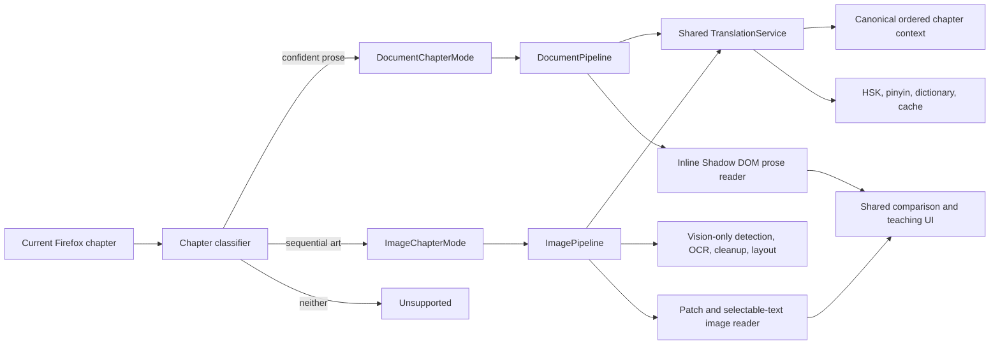

# Hskify chapter architecture

Hskify translates one current English chapter into Simplified Chinese. One
browser controller chooses exactly one mode: `document`, `image`, or
`unsupported`. Document and image work share session ownership, transport,
language correctness, teaching tools, and recovery; modality-specific code is
limited to acquisition and rendering.

## System shape

```mermaid
flowchart LR
    Page["Current Firefox chapter"] --> Classifier["Chapter classifier"]
    Classifier -->|"confident prose"| DocumentMode["DocumentChapterMode"]
    Classifier -->|"sequential art"| ImageMode["ImageChapterMode"]
    Classifier -->|"neither"| Unsupported["Unsupported"]

    DocumentMode --> DocumentPipeline["DocumentPipeline"]
    ImageMode --> ImagePipeline["ImagePipeline"]
    DocumentPipeline --> Language["Shared TranslationService"]
    ImagePipeline --> Language
    ImagePipeline --> Vision["Vision-only detection, OCR, cleanup, layout"]
    Language --> Context["Canonical ordered chapter context"]
    Language --> Control["HSK, pinyin, dictionary, cache"]

    DocumentPipeline --> DocumentReader["Inline Shadow DOM prose reader"]
    ImagePipeline --> ImageReader["Patch and selectable-text image reader"]
    DocumentReader --> CommonUI["Shared comparison and teaching UI"]
    ImageReader --> CommonUI
```

The fixed public identities are:

- build fingerprint:
  `hskify-windows-x86_64-msvc-cuda13.1-sm89-2026-08-09-r8`;
- Firefox extension: `hskify@local.hskify`;
- native host: `local.hskify.browser`;
- executables: `hskify-native-host` and `hskify-browser-daemon`;
- browser headers: `X-Hskify-Extension-Origin` and `X-Hskify-Control`;
- environment, storage, CSS, and data prefixes: `HSKIFY_*` and `hskify`.

Those identifiers are a clean protocol and installation break. There are no
aliases, old-route parsers, storage migrations, host cleanup paths, or protocol
adapters.

## Browser classification and extraction

The classifier first attempts a document descriptor. It annotates a clone of
the page with temporary source markers and runs `@mozilla/readability` 0.6.0
against that clone with a DOM serializer. Readability output is never inserted
into the live page. Accepted elements map back through the temporary markers.

A document descriptor is valid only when all of these are true:

- at least five translatable story blocks;
- at least 1,000 normalized characters;
- alphabetic content is predominantly English;
- every accepted block maps to the live page; and
- the mapped content root is a descendant below `body`, never `body` itself.

A valid document descriptor wins, so chapter illustrations remain ordinary
illustrations. Otherwise the sequential-art detector decides whether image mode
is safe. Publisher selectors and a manual mode override are intentionally not
part of classification.

The document snapshot preserves order and semantics. Translatable nodes are
title, leveled heading, paragraph, blockquote, ordered/unordered list item, and
figure caption. Illustrations and separators are structural preserved items.
Navigation, ads, bylines/metadata, comments, forms, and site UI are excluded.
Whitespace normalization is deterministic. A text-block ID derives from its
order, kind, and normalized source text, while the document hash covers the
complete ordered text snapshot. Chapters over a native limit are rejected, not
truncated.

## Shared controller and render targets

One page controller owns run state, native session discovery, update polling,
acknowledgements, cancellation, recovery, HUD state, and navigation. It creates
exactly one `DocumentChapterMode` or `ImageChapterMode`. Both implement the same
small render-target interface used by one singleton Original/Chinese/
hold-to-compare controller.

The document renderer keeps mapped source elements in their original page
positions and substitutes safe translated text inside those elements. It never
copies arbitrary HTML, scripts, styles, links, or controls, and it does not add
a reader background or restyle the chapter surface. Existing illustrations and
separators remain connected. Pending and terminal-preserved blocks use empty
line-box placeholders, so Chinese mode contains no English fallback text.

The original child nodes and attributes of every mapped block are retained by
identity. Original mode, cancellation, source mutation, SPA navigation, and
controller disposal restore them and remove only Hskify-owned metadata and
overlay UI. Switching modes preserves the nearest block scroll anchor.

An `IntersectionObserver` reports visible document block IDs. Focus reports are
coalesced at 100 ms and never run a synchronous geometry loop on scroll. Image
mode reports normalized visible rectangles through the same focus route.

The image renderer keeps source image nodes connected and uses isolated patch
and selectable-text layers. It still requires a decoded cleanup patch before
installing final Chinese. Image output and reading-direction behavior remain
unchanged.

## Native pipelines and runtime ownership

`TranslationService` owns model generation, faithful-result validation, HSK
realization, pinyin and teaching metadata, dictionary lookup context, and the
translation cache. It accepts generic ordered source spans:

- kind: `prose`, `heading`, `dialogue`, `caption`, `thought`, or `sfx`;
- provenance: `dom` or `ocr`;
- optional layout constraints, present only for image regions.

Shared prompts contain no bubble, comic, or OCR language. The adapter adds one
OCR-correction instruction only for `ocr` spans; DOM text is authoritative.

`ImagePipeline` owns only raster validation, detection, OCR, visual
adjudication, segmentation, cleanup, and layout. `DocumentPipeline` owns block
registration, token-aware segmentation, priority scheduling, joined-block
validation, and publication. Every document block is registered before any
translation starts. The generic context store is always ordered by
`(sourceIndex, itemOrder)`, so viewport priority changes execution order but
never context or publication order.

`LanguageRuntime` contains the one resident Qwen model, HSK data, dictionary,
and translation cache. `VisionRuntime` contains detector, OCR, segmenters,
inpainter, and projector and reuses the already-loaded language model. A
document warm-up initializes only `LanguageRuntime`; an image warm-up
initializes both. There is one installable resource pack and one serialized CUDA
language lane, never a second model instance or a novel-specific deployment.

## Translation correctness and scheduling

The resident language context is 4,096 tokens. The real tokenizer packs at most
six ordered units. Only a single document block that cannot fit alone is split,
at ICU sentence boundaries while retaining line-break separators. Its pieces
can execute independently, but the block is published only after they are
joined and validated as one result.

The shared final-only policy is:

1. establish faithful Simplified Chinese;
2. in natural mode, publish it with deterministic teaching metadata;
3. in strict mode, realize the requested HSK level and allow at most one
   terminal repair;
4. never expose provisional Chinese.

If any piece remains invalid, document mode publishes a source-preserving block
result but withholds that English block from Chinese mode; Original mode still
contains the untouched source. A fatal document failure restores the original
page. Completion reports translated and preserved counts.

Visible document work is dispatched first: the first visible block is sent by
itself, followed by tokenizer-sized batches of up to six. The bounded preceding
and following source context comes from registration order, not dispatch order.

## Updates, replay, and cache

The API uses exact unversioned routes: `POST /jobs/image`,
`POST /jobs/document`, and `PUT /jobs/{jobId}/focus`, plus common update,
cancellation, chapter-release, lookup, blob, and font routes. See the
[browser contract](browser-contract.md) for payloads and bounds.

`TranslatedText` is the shared final payload: source, faithful/base, displayed
Chinese, pinyin, and HSK state. It is composed into `imageRegionReady`,
`documentBlockReady`, or `documentBlockPreserved`. Lookup ownership is always
`itemId`.

Active jobs and page artifacts use an exact `image | document` tagged union.
The append-only update log, acknowledgement cursor, and replay code are common.
An unacknowledged update may replay after MV3 suspension, but idempotent
installation applies it once. Recovery requires the same source modality and
hash, preventing document output from attaching to a changed chapter.

The persistent completed-result cache also stores a tagged image or document
entry. A document entry contains final blocks and lookup contexts. Cache
identity covers the source hash, mode, requested level, surrounding context,
model/prompt/validator identities, and HSK resources. There is one current
schema only.

## Resource bounds and performance gates

| Resource | Limit |
| --- | ---: |
| Document JSON body | 1 MiB UTF-8 |
| Document text blocks | 2,000 |
| One document block | 16 KiB UTF-8 |
| Visible document block IDs | 64 |
| Language context | 4,096 tokens |
| One language batch | 6 ordered units |
| Image multipart field | 20 MiB |
| Decoded image pixels | 25,000,000 |
| Either image dimension | 16,384 px |

The native daemon recomputes the canonical document hash and rejects unknown
fields, invalid bounds, and modality mismatches before work begins.

The representative local document benchmark is 300 blocks and 100,000
characters. Extraction plus reader skeleton p95 must remain below 100 ms on the
supported workstation, with no scroll-time synchronous layout loop or task over
50 ms. Instrumented document jobs must allocate or invoke no detector, OCR,
projector, segmentation, inpainting, patch, font, or other vision resource.

Image language throughput may regress by no more than 10 percent from the
pre-refactor local baseline. The full image runtime with the 4,096-token
language context must remain within the supported 16 GB VRAM envelope.
