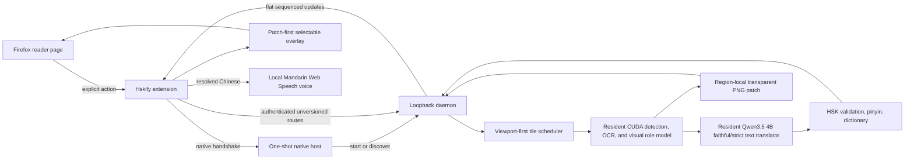

# Hskify performance architecture

Hskify is a local Firefox-to-native pipeline specialized for low time-to-first
translated dialogue on one CUDA machine class. The browser and daemon exchange
an append-only sequence of small region updates; they never wait for or
transfer a reconstructed page.

## System shape

```mermaid
flowchart LR
    Reader["Firefox reader page"]
    Extension["Hskify extension"]
    Host["One-shot native host"]
    Daemon["Loopback daemon"]
    Scheduler["Viewport-first tile scheduler"]
    Vision["Resident CUDA detection, OCR, and visual role model"]
    Translator["Resident Qwen3.5 4B faithful/strict text translator"]
    Control["HSK validation, pinyin, dictionary"]
    Patch["Region-local transparent PNG patch"]
    Overlay["Patch-first selectable overlay"]
    Speech["Local Mandarin Web Speech voice"]

    Reader -->|"explicit action"| Extension
    Extension -->|"native handshake"| Host
    Host -->|"start or discover"| Daemon
    Extension -->|"authenticated unversioned routes"| Daemon
    Daemon --> Scheduler --> Vision
    Vision --> Patch
    Vision --> Translator --> Control
    Patch --> Daemon
    Control --> Daemon
    Daemon -->|"flat sequenced updates"| Extension
    Extension --> Overlay --> Reader
    Extension -->|"resolved Chinese"| Speech
```

## Build affinity and trust boundary

`hskify-windows-x86_64-msvc-cuda13.1-sm89-2026-07-28-r7` is compiled into the TypeScript and Rust
contracts. Native handshake requests and responses, health responses, and job
creation metadata must carry that exact value. A different value is rejected.
There is no protocol-version header, range negotiation, compatibility shim, or
migration adapter.

The Windows release wrapper writes a post-success, ignored JSON attestation
covering the complete tracked and untracked-nonignored source identity, exact
x86_64 MSVC release/CUDA configuration, pinned toolchain and llama.cpp tag,
device-0 hardware/driver claims, and SHA-256/byte identities for both native
binaries. Packaging and benchmark preflight reject missing, stale, mutated, or
nonmatching attestations.

The native host accepts only the registered
`local.hskify.hsk_manga` manifest whose executable resolves to the running
binary and whose sole allowed extension is
`hsk-manga-translator@local.hskify`. It asks the daemon for a fresh 256-bit
bearer token bound to the exact canonical `moz-extension://` origin.

The daemon binds to a random `127.0.0.1` port. Browser requests require the
exact `Host`, the active extension origin (standard `Origin` and/or
`X-HSK-Manga-Extension-Origin`), and the bearer token before request-body
polling. CORS allows only that origin and the required GET, POST, PUT, and
DELETE methods. No general application router, URL fetch, telemetry, provider
credential, or remote translation path is mounted.

## Direct chapter-aware data flow

1. The extension uploads one raster plus strict metadata to `POST /jobs`.
   Byte, MIME, hash, declared dimension, decoded dimension, pixel, and decoder
   allocation checks occur before the job begins.
2. The source is decoded once. The adapter divides it into 2,048-pixel tiles
   with 410-pixel overlap and reprioritizes remaining tiles whenever the
   viewport changes.
3. The pinned RT-DETR-v2 comic detector processes true CUDA batches of up to
   six tiles at its trained 640-pixel input size. Both `text_bubble` and
   `text_free` proposals continue to recognition; bubble rectangles are not a
   prerequisite. This covers dialogue, thoughts, captions, and unballooned
   story text while leaving the final semantic decision to OCR. Text proposals
   are spatially deduplicated at tile overlaps.
4. PP-OCRv6-small independently detects and recognizes text in batches of
   eight. Mechanically valid Latin OCR at the calibrated 0.55 confidence floor
   or higher remains
   eligible; hard-coded content word lists do not decide whether a line is
   story text.
5. Learned bubble segmentation assigns accepted lines to real bubble identities
   so an entire balloon is processed atomically. PP-OCRv6-small remains the
   sole source of line polygons; manga-text segmentation supplies only the
   glyph matte and appearance evidence used for cleanup. Shared geometry
   expansion grows its mask around the detected glyphs, and manga LaMa restores
   the source artwork. Transparent region patches take alpha only from that
   verified semantic mask. Layout uses the measured, eroded bubble contour
   rather than a fixed detector-box inset. A proposal that fails two distinct
   OCR views becomes an `UnreadableRegion` and stays pixel-identical.
6. Qwen3.5 4B sees one bounded page/evidence viewport and immutable numbered
   OCR polygons. It returns only `story`, `sfx`, `furniture`, or `artwork` plus
   an optional story continuation. Furniture and artwork remain pixel-identical;
   story and SFX continue. Malformed records fail per region instead of
   discarding valid siblings.
7. Only admitted story/SFX regions enter glyph segmentation. One page cleanup
   task acquires the serialized Vision lane while a text-only faithful batch of
   at most six regions acquires the separate Language lane. The role-position
   index is separate from numbered source lines, and deterministic validation
   rejects label leakage, Latin output, punctuation-only output, source echo,
   and malformed/missing positions. Chapter context is refreshed at language
   dispatch rather than snapshotted when the page job starts.
8. Natural mode publishes the faithful Chinese after deterministic HSK
   annotation. Strict mode performs a bounded HSK rewrite and allows at most
   one terminal repair for invalid items. `hsk-control` owns vocabulary,
   pinyin, and teaching-term ranges; names must be rendered in Chinese and
   standalone numbers/question intent remain preservation requirements.
   Digits embedded in Latin OCR tokens such as `IDENTIT4` are not treated as
   semantic numbers.
9. For each completed region, the daemon stores the patch blob first and then
   appends `regionReady`, which carries the patch descriptor, geometry, source
   text, base/direct Chinese, displayed Chinese, pinyin, style, layout, and HSK
   status. The contract rejects pending state, so this is the only visible
   version of the translation. Ordered color bands preserve real foreground/outline changes between
   source lines, and Firefox keeps that band count while fitting the translation.
10. Firefox fetches and validates the PNG, decodes it, inserts it in the patch
   layer, and only then inserts the selectable final text.

Completion is a terminal event in the same log. It does not unlock a separate
result representation.

## Live-page rendering

The renderer never reparents, replaces, hides, or rewrites the reader's source
`img`. One document-anchored shadow-DOM portal shares the image's scroll
coordinate space and contains only transparent patch and selectable-text
layers. Normal document scrolling therefore stays compositor-only. Nested
scrollers trigger a position-only update, while resize and responsive layout
changes trigger a complete geometry/text refit. Cancellation or navigation
removes the portal and leaves the untouched source DOM in place.

The original/Chinese/hold-to-compare controls live in a separate fixed
shadow-DOM host at the viewport edge, so they remain reachable while reading a
long chapter. Pointer hit-testing maps a hovered rendered glyph to a Unicode
character offset. The daemon then performs a dictionary longest-match anchored
at that exact offset; selection remains an explicit fallback. The explanation
is placed outside the resolved glyph range when space permits, clamped to the
viewport, and dismissed on scroll, resize, or pointer departure.

## Scheduling and cache identity

The daemon stays warm for a 30-minute idle window and uses four Tokio workers,
at most eight general blocking threads, separate serialized priority CUDA
lanes for Vision and Language, and one dedicated six-thread Rayon pool for
browser image preprocessing. Queue membership is cancellation-safe: dropping
an acquiring future removes its waiter, so an aborted cleanup cannot orphan a
lane. The comic detector, OCR recognizer, local LLM
application state, and HSK control data are lazy `OnceCell` residents, so later
jobs reuse loaded state.

Firefox immediately admits at most two page jobs subject to a two-page decoded
pixel budget. It does not serialize startup, impose page-completion barriers,
or cancel/restart admitted off-screen pages. Pending work is continuously
reprioritized from the current viewport; this keeps both CUDA lanes supplied
while allowing newly visible queued work to overtake off-screen work.

The 64 MiB byte-bounded in-memory translation cache is keyed by:

- normalized OCR text;
- the complete faithful Chinese reference and utterance role;
- the canonical chapter context preceding the region;
- bounded following English context;
- requested HSK level;
- natural or strict learning mode;
- model ID and exact model revision;
- prompt hash;
- validator hash; and
- the full HSK/dictionary control revision.

Changing any output-affecting dependency invalidates the cache. There is no
project cache, page history, stored page reconstruction, or level-change
retranslation endpoint.

Decoded images use a 512 MiB byte-bounded LRU. Completed terminal
chapter-region results and PNG patches also have a byte-bounded
2 GiB persistent cache. Its key includes the complete strict job request,
source hash, exact build fingerprint, and a fingerprint of every
output-affecting model, prompt, validator, dictionary, and pipeline resource.
Entries are atomically installed only after visible processing completes.
Stores enforce the 2 GiB bound and perform eviction once; reads open the exact
SHA-keyed entry directly instead of rescanning the cache directory for every
image. Every upload still validates its byte limit, SHA-256, encoded format,
MIME, declared limits, and header dimensions. An exact hit then reuses the
previously fully decoded/validated result; full pixel decoding occurs only on
a miss. No detector, OCR, translation, or patch intermediate is written to
disk.

The chapter job log is append-only, starts at sequence 1, rejects regressive overall
progress, rejects duplicate region publication, and permits one terminal
`complete`, `failed`, or `cancelled` event. Clients long-poll after the last
acknowledged sequence, so extension background suspension does not require a
second status/result model.

## Resource envelope

| Resource | Default |
| --- | ---: |
| Image multipart field | 20 MiB |
| JSON metadata field | 64 KiB |
| Complete HTTP body | 21 MiB |
| Decoded pixels | 25,000,000 |
| Either dimension | 16,384 px |
| Decoder allocation | 128 MiB |
| Decoded-image LRU | 512 MiB |
| In-memory translation cache | 64 MiB |
| Persistent completed-result cache | 2 GiB |
| One patch blob | 16 MiB |
| Retained jobs | 128 |
| Retained sources and patches | 256 MiB |
| Authenticated in-flight requests | 64 |
| Updates per job | 10,000 |
| One update long-poll | 20 seconds maximum |
| Idle daemon window | 30 minutes |

Terminal inactive jobs are evicted oldest-first when job or byte capacity is
needed. Active jobs are never eviction candidates. Patch blobs are owned by
one job and removed with it.

## Hardware boundary

The performance build is CUDA-only and gated to an NVIDIA GeForce RTX 4080
SUPER with at least 16,000 MiB, compute capability 8.9, and the pinned CUDA
13.1 compiler packages. This is an intentional optimization boundary, not a
recommended tier among several. Results from another GPU, a CPU path, or a
different model revision are not evidence for this build.

## Reader features retained

The chapter-aware architecture preserves:

- selectable Chinese with displayed pinyin;
- position-anchored hover explanations with local longest-match dictionary
  definitions and HSK overlay;
- region context showing direct/displayed Chinese and source English;
- original/Chinese/hold-to-compare controls; and
- local-only Mandarin pronunciation using an eligible Firefox/OS voice.

These browser tools do not delay offscreen inference. Region order is stable
page order followed by within-page reading order, while current-viewport work
may overtake queued offscreen work at detector, OCR, and translation batch
boundaries.

See [the browser contract](browser-contract.md) for exact routes and event
shapes and [the real-reader v2 evidence plan](real-reader-v2.md) for the
content-addressed corpus and packaged release measurements. The tracked
manifest remains capture-required until all local pages and annotations are
present.
